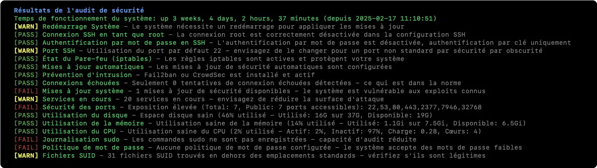

# Script d'audit de sécurité pour VPS (version française)


Ceci est une version traduite et adaptée en français du script [vps-audit](https://github.com/vernu/vps-audit), destiné à auditer la sécurité, les performances et surveiller l'infrastructure des serveurs Linux.


<!-- add a screenshot of the output here -->



## Fonctionnalités

Ce script en bash, léger et sans dépendances, effectue les vérifications suivantes :

- **Configuration SSH :**
  - Statut de connexion root
  - Authentification par mot de passe
  - Utilisation de port non standard
- État du Pare-feu (UFW, firewalld, iptables ou nftables)
- Configuration de Fail2ban ou CrowdSec
- Tentatives de connexion échouées
- Statut des mises à jour du système
- Analyse des services en cours d'exécution
- Détection des ports ouverts
- Vérification de la journalisation des commandes sudo
- Politique de mot de passe
- Vérification des fichiers SUID suspects

## Installation

**1. Téléchargez le script :**

```bash
wget https://raw.githubusercontent.com/slymb/vps-audit-fr/main/vps-audit-fr.sh
```
ou
```bash
curl -O https://raw.githubusercontent.com/slymb/vps-audit-fr/main/vps-audit-fr.sh
```

**2. Rendez le script exécutable :**

```bash
chmod +x vps-audit-fr.sh
```

**3. Lancez le script avec les privilèges sudo :**

```bash
sudo ./vps-audit-fr.sh
```

## Exécution

Le script affiche les résultats en temps réel, avec des couleurs pour indiquer l'état :

- 🟢 `[PASS]` – Vérification réussie
- 🟡 [WARN] - Problèmes potentiels détectés
- 🔴 [FAIL] - Problèmes critiques détectés

Un rapport détaillé nommé `rapport-audit-vps-[HORODATAGE].txt` est également généré, contenant :

- Résultats détaillés des tests
- Recommandations spécifiques pour les tests échoués
- Statistiques d'utilisation des ressources système
- Horodatage de l'audit

## Seuils utilisés

### Seuils d'utilisation des ressources

- **Utilisation des ressources :**
  - 🟢 PASS : < 50%
  - 🟡 WARN : 50% à 80%
  - 🔴 FAIL : >80%

- **Services actifs :**
  - 🟢 Moins de 20
  - 🟡 Entre 20 et 40
  - 🔴 Plus de 40

- **Ports ouverts :**
  - 🟢 Moins de 10
  - 🟡 Entre 10 et 20
  - 🔴 Plus de 20

## Installation des dépendances

Le script nécessite :

- Bash
- Accès root/sudo
- Debian/Ubuntu
- Dépendances courantes (`netstat`, `grep`, `awk`, `curl` ou `wget`)

## Maintenance et bonnes pratiques

- Maintenez le script à jour par rapport au dépôt original
- Vérifiez régulièrement les rapports générés
- Traitez immédiatement les alertes critiques (🔴 FAIL)
- Inspectez les avertissements (🟡 WARN) lors des maintenances régulières
- Adaptez le script à vos politiques de sécurité internes

## Limitations

- Conçu principalement pour Debian/Ubuntu
- Nécessite des privilèges root ou sudo
- Certains tests pourraient nécessiter une adaptation selon votre environnement spécifique

## Licence et Origine

Ce dépôt est un fork de [vps-audit](https://github.com/vernu/vps-audit), traduit et adapté en français pour une utilisation simplifiée et une meilleure accessibilité à la communauté francophone.

Respectez la licence originale du projet parent lors de l'utilisation ou de la distribution de ce script.

## Support

En cas de problème :

- Consultez les issues existantes
- Ouvrez une nouvelle issue en précisant votre problème
- Fournissez la sortie du script et les informations sur votre système

Bonne sécurisation de vos serveurs ! 🚀🔒

